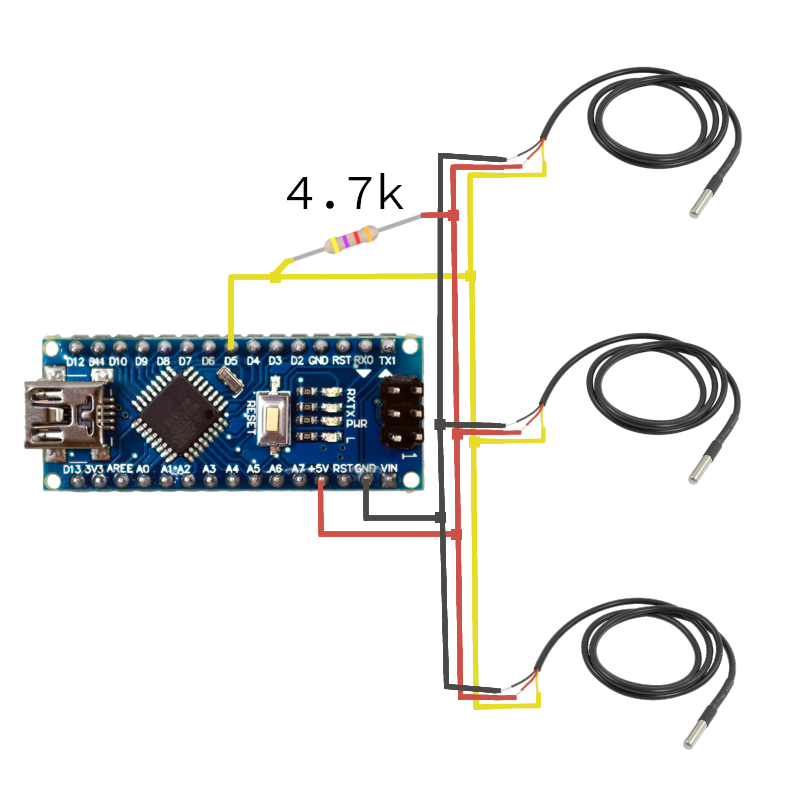
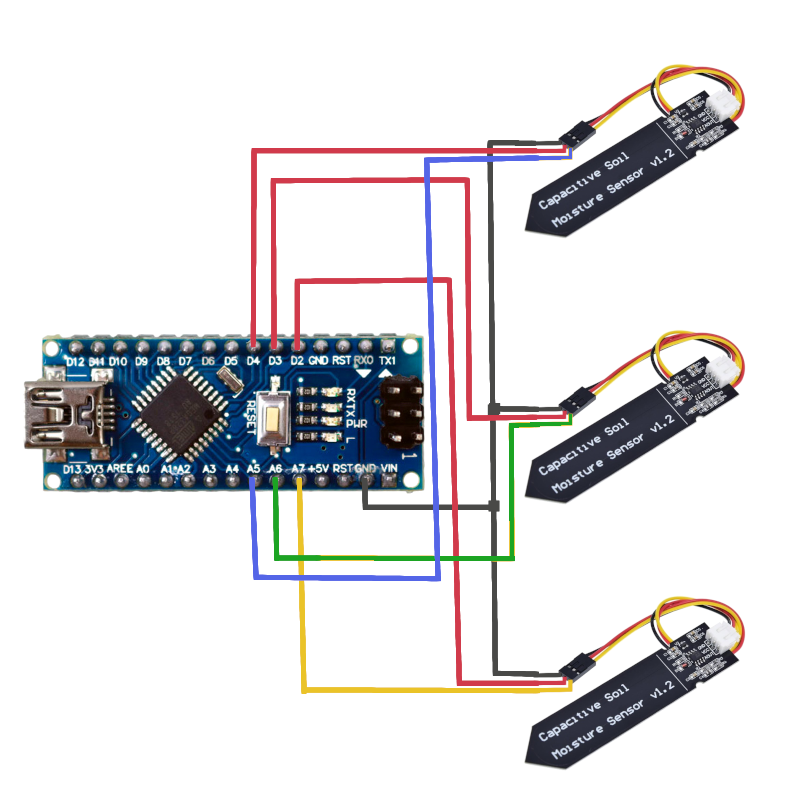
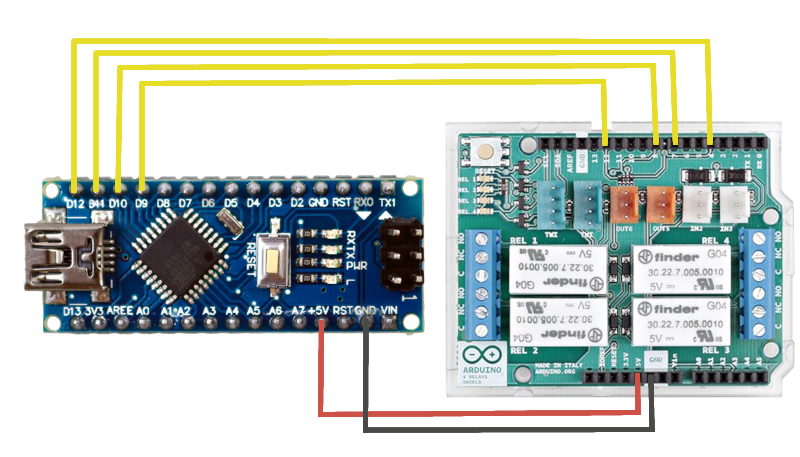
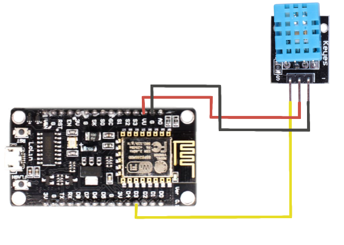
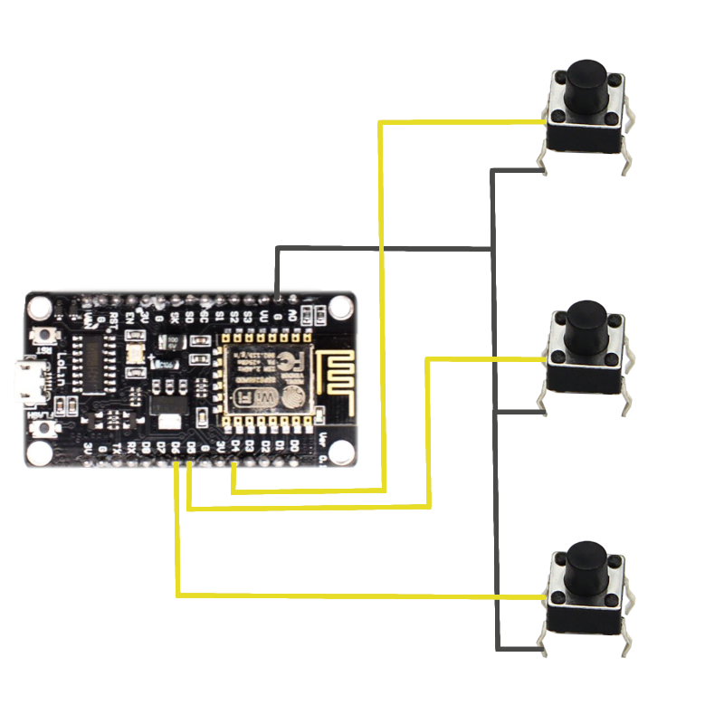
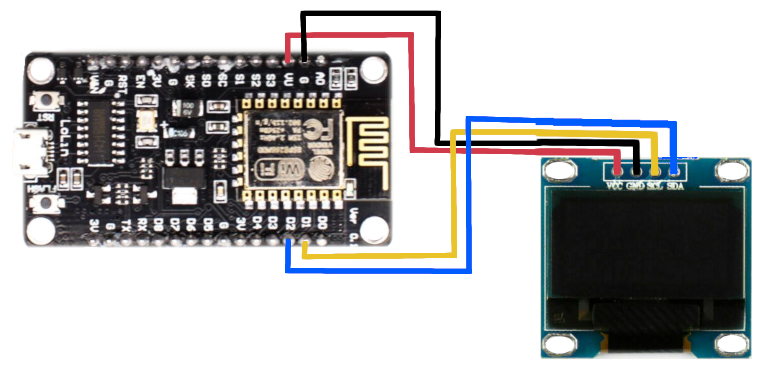
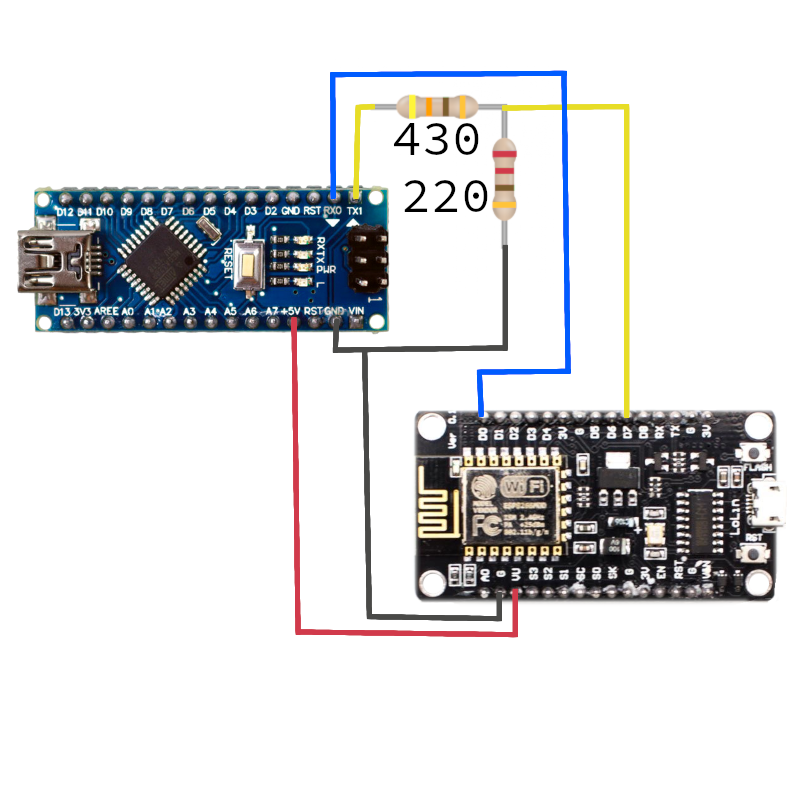

# Build Instructions

The easiest way to build the system is to add the different components one by one until everything is connected. We will first focus on the Arduino Nano and then on the NodeMCU.
Each parts add new components but even if the already present components are not shown in the picture, you don't have to remove them.

## Arduino Nano
### DS18B20s
First connect the three sensors and the resistor to the Arduino Nano as shown in the picture :



Then test the sensors using the code located in src/Tests/ArduinoNano/DS18B20s and reading the values on the Serial Monitor (Ctrl+Shift+M)
You should get something similar to that :
```
Sensor 1: 22.1  C
Sensor 2: 22.2  C
Sensor 3: 22.1  C
```

### Capacitive Soil Moisture Sensors
First connect the three sensors to the Arduino Nano as shown in the picture :



Then test the sensors using the code located in src/Tests/ArduinoNano/SoilMoistureSensors and reading the values on the Serial Monitor (Ctrl+Shift+M)
You should get something similar to that :
```
Sensor 1: 65.2%
Sensor 2: 65.3%
Sensor 3: 65.3%
```

### Relays
First connect the four relays to the Arduino Nano as shown in the picture :



Then test the sensors using the code located in src/Tests/ArduinoNano/Relays.
The relays will power up one by one for 1 second and then wait for 2 seconds before starting again.


## NodeMCU
### DHT11
First connect the sensor to the NodeMCU as shown in the picture :



Then test the sensors using the code located in src/Tests/NodeMCU/DHT11 and reading the values on the Serial Monitor (Ctrl+Shift+M)
You should get something similar to that :
```
Temperature : 22.1 C
Humidity : 65.1%
```

### Push Buttons
First connect the three buttons to the NodeMCU as shown in the picture :



Then test the buttons using the code located in src/Tests/NodeMCU/Buttons and reading the values on the Serial Monitor (Ctrl+Shift+M) while pushing the buttons
You should get something similar to that :
```
Lamp button : 1
Pump button : 0
Sensors button : 1
```

### SSD1306 OLED Display
First connect the display to the NodeMCU as shown in the picture :



Then test the display using the code located in src/Tests/NodeMCU/OLED and there should be some text appearing on the display for 5 seconds and then a number quickly updating.

### Blynk
First build the Blynk interface as shown in the ReadMe.md file and then upload the test code located in src/Tests/NodeMCU/Blynk to the NodeMCU (don't forget to update the WiFi and Blynk settings at the beginning of the code) and you should get random values appearing in the app.


## UART
Once everything works properly, upload the main code to each microcontrollers (src/ArduinoNano and src/NodeMCU (don't forget the WiFi and Blynk settings in constants.h)) and connect them together as shown in the picture :



Warning : Don't connect the usb cable to the Arduino Nano, everything is powered by the NodeMCU !

A few seconds after powering up the whole system you should get all the sensors values on the screen (push the sensors button to navigate though the menus) and the automatic control should start working too.
