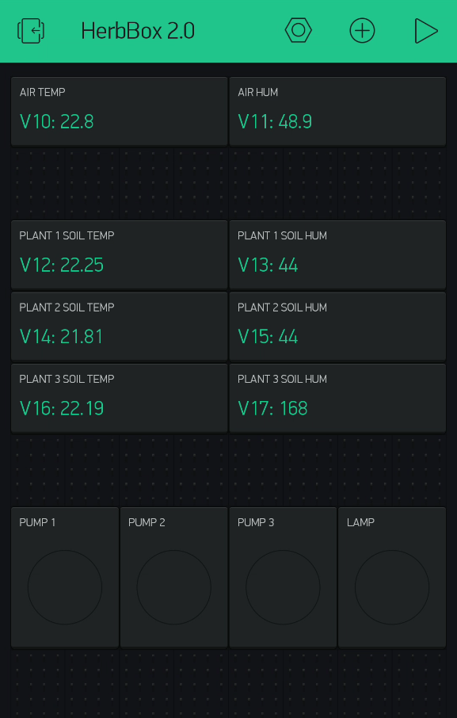

# HerbBox 2.0

HerbBox is an automatic system to control the humidity and the temperature of three plants.

This system use two microcontrollers talking together, an Arduino Nano and a NodeMCU v3 (This is because we already had them so it was better than buying a bigger microcontroller)

(Documentation in progress)

## Schematics

## NodeMCU
### Board settings
- Add the ESP8266 board library to the Arduino IDE (http://arduino.esp8266.com/stable/package_esp8266com_index.json)
- Install the "esp8266 by ESP8266 Community" package though the board manager
- Use the "NodeMCU 1.0 (ESP-12E Module)" board when uploading the sketch

### Required arduino libraries
- DallasTemperature (Version from Arduino IDE)
- OneWire (Version from Arduino IDE)
- SimpleTimer (This particular version is needed : https://github.com/schinken/SimpleTimer)

### Attached sensors / actuators
- 3x DS18B20
- 3x Capacitive Soil Moisture Sensor v1.2
- 4x Relays

## Arduino Nano
### Board settings
- Use the "Arduino Nano" board when uploading the sketch

### Required arduino libraries
- ACROBOTIC SSD1306 (Version from Arduino IDE)
- Blynk (Version from Arduino IDE)
- DHT sensor library (Version from Arduino IDE)
- SimpleTimer (This particular version is needed : https://github.com/schinken/SimpleTimer)

### Attached sensors / actuators
- DHT11
- 3x push button
- SSD1306 OLED display

## Blynk
We use an application named [Blynk](https://blynk.io/) to display sensors values on a smartphone.

### App configuration
To connect the NodeMCU to the Blynk app you will have to generate a token in the Blynk app and copy-paste it in the **BLYNK_TOKEN** constant in src/NodeMCU/constants.h . You will also have to connect the NodeMCU to the same WiFi connection as the smartphone using the **WIFI_SSID** (WiFi name) and **WIFI_PASSWD** (WiFi password) constants.

### Exposed interface
The NodeMCU send the values to Blynk on the following virtual lines :
- **V10** : Air temperature
- **V11** : Air humidity
- **V12** : Plant 1 soil temperature
- **V13** : Plant 1 soil humidity
- **V14** : Plant 2 soil temperature
- **V15** : Plant 2 soil humidity
- **V16** : Plant 3 soil temperature
- **V17** : Plant 3 soil humidity

It also controls 4 leds to reflect the relays states :
- **V0** : Pump 1
- **V1** : Pump 2
- **V2** : Pump 3
- **V3** : Lamp

### Configuration example
Here is an example of how we configured Blynk. At the top we have two "Value Display" to show air sensors values, in the middle we have six "Value Display" to show plant sensors values and at the bottom we have four "LED" to show the state of the pumps and the lamp.

## Automatic control settings
All settings for the automatic control are stored in src/NodeMCU/constants.h . It means that the NodeMCU program needs to be reuploaded when you want to make changes to the settings.

### Soil settings
- **PLANT1_DRY_SOIL**: Value of the soil humidity under which the soil is considered dry. Value between 0% and 100% (Default: 66).
- **PLANT1_WET_SOIL**: Value of the soil humidity over which the soil is considered wet. Value between 0% and 100% (Default: 85).
- **PLANT1_TIME_PUMP_ON**: Duration during which the pump is powered on to water the plant if the soil is dry. Value in ms with a L at the end (Default: 15000L).

For plant 2 and plant 3, just change the one with a 2 or a 3 in the name instead of a 1.

### Air settings
- **COLD_TEMP**: Value of the air temperature under which the air is considered cold. Value in Celsius degree (Default: 12).
- **HOT_TEMP**: Value of the air temperature over which the air is considered hot. Value in Celsuis degree (Default: 22).
- **TIME_LAMP_ON**: Duration during which the lamp is powered on to warm up the plants if the temperature is cold. Value in ms with a L at the end (Default: 15000L).
